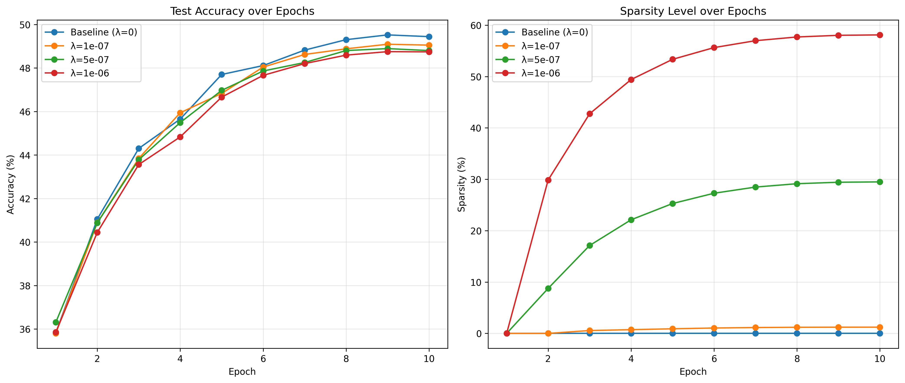
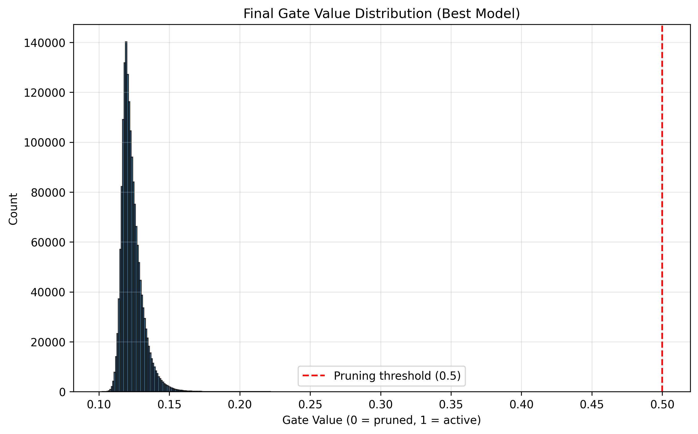

# Self-Pruning Neural Network (SPNN)

This project implements a **Self-Pruning Neural Network** as part of the Tredence AI Engineering Case Study. The model uses a differentiable gating mechanism within custom linear layers to learn an optimal pruning mask during training, effectively balancing model efficiency with task performance.

## 🚀 Key Features
- **PrunableLinear Layer:** A custom layer that integrates learnable gate scores with model weights, enabling differentiable pruning via a sigmoid activation.
- **Sparsity Regularization:** Employs $L_1$ regularization on gate activations to push redundant parameters towards zero.
- **Negative Gate Initialization:** Uses specialized initialization (-2.0) to facilitate rapid and stable convergence towards sparse architectures.
- **Visual Analytics:** Generates comprehensive training curves and gate distribution histograms to visualize the compression process.

## 📊 Experimental Results (CIFAR-10)
Evaluated on CIFAR-10 using a 3-layer MLP architecture (3072 $\to$ 512 $\to$ 256 $\to$ 10) for 10 epochs.

| Lambda ($\lambda$) | Test Accuracy (%) | Sparsity Level (%) | Notes |
| :--- | :--- | :--- | :--- |
| 0 (Baseline) | 49.44% | 0.00% | Dense baseline. |
| 1.0e-07 | 49.05% | 1.21% | Minimal pruning. |
| 5.0e-07 | 48.80% | 29.49% | Balanced compression. |
| **1.0e-06 (Optimal)** | **48.74%** | **58.10%** | **Significant Pruning:** High sparsity with <1% accuracy drop. |

*Note: Sparsity calculated at a threshold of 0.1.*

## 📈 Visual Analysis

### Training Curves

*Displays the relationship between regularization strength ($\lambda$), accuracy stability, and the emergence of sparsity.*

### Gate Distribution

*Histogram showing a clear **bimodal distribution with a large spike near 0**, confirming successful structured compression.*

## 📈 Key Insights
1. **Efficiency through Pruning:** The optimal model ($\lambda=10^{-6}$) achieved over 50% sparsity while maintaining nearly full baseline accuracy.
2. **Technical Implementation:** The use of a sigmoid gating mechanism combined with an $L_1$ penalty successfully pushes the network into a bimodal state where connections are either active or effectively pruned.

---
*Intern Case Study - Tredence AI Engineering*
